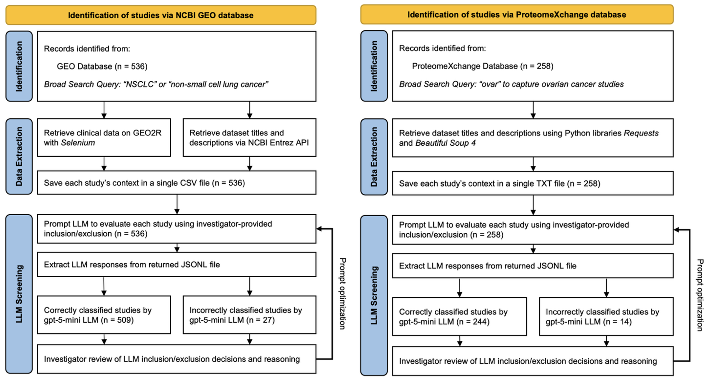

# Finding Datasets with LLMs


## Citation


## Requirements
All code was written in Python 3.10.9. Required packages can be installed via:
```
pip install -r requirements.txt
```

## Gene Expression Omnibus
### Step 1: NCBI Search (`ncbi-search-to-excel.py`)
- Search NCBI GEO with a given search query.
- Fetches metadata for each dataset found.
- Outputs Excel file with returned metadata and GEO accession IDs. 

### Step 2: Save GEO2R Clinical Data Annotations (`excel-to-geo2r-csv.py`)
- Reads the Excel file from Step 1.
- Uses Selenium to save clinical data tables from GEO2R for each dataset.
- Saves each dataset as: `samples_table_{GSE_ID}.csv` in `case-1/` folder.

### Step 3: Add Title & Description Metadata to CSVs (`case-1/replace-metadata.py`)
- Reads all CSV files from Step 2.
- Fetches title and description for each dataset from NCBI.
- Appends metadata as header comments to each CSV:

```
# TITLE: {dataset_title}
# SUMMARY: {dataset_description}
```

### Step 4: Create Batch Requests to Prompt LLM (`csv-to-openai.py`)
- Creates OpenAI batch request with:
	- System prompt (expert instructions)
	- User prompt (questions)
	- CSV data for each dataset
- Uploads to OpenAI. 
- Saves: `{project}_batch_requests.jsonl` and `{project}_batch_output.jsonl`.

**NOTE:** Add your [OpenAI API key](https://platform.openai.com/api-keys) in the .env file. 

> While the script monitors and downloads batches once they complete, completed batches can also be downloaded from the OpenAI API platform for the next step. 

### Step 5: Parse Batch Results (`4omini-to-excel.py`)
- Parses LLM responses from batch output JSONL files.
- Extracts answers to inclusion/exclusion questions.
- Compares predictions against investigator-identified studies (used as ground truth).
- Calculates sensitivity, specificity, precision, accuracy, and F1 score.
- Saves model performance results in `model_performance_results.json`.
- Saves parsed responses to `{project}_batch_output.csv`.

### Step 6: Plot Results (`plot_results.py`)
- Loads model performance results from `model_performance_results.json`.
- Plots trial metrics by model and prompt version. 
- Writes a summary table CSV.

## ProteomeXChange
### Step 1: Fetch Dataset Metadata (`proteomexchange.py`)
- Loads dataset IDs from `proteomexchange_datasets.json` (downloaded from ProteomeXchange).
- Retrieves each dataset's description.
- Saves each dataset as: `{PXD_ID}.txt` in the specified output directory (e.g., `proteomexchange_7_24_25/`).

### Step 2: Create Batch Requests to Prompt LLM (`json-to-openai-proteom.py`)
- Reads all `.txt` files from the dataset directory (e.g., `proteomexchange_7_24_25/`).
- Creates OpenAI batch request with:
  - System prompt (expert instructions)
  - User prompt (inclusion/exclusion criteria questions)
  - Dataset title and description for each study
- Uploads batch to OpenAI.
- Saves: `batch_requests_{model}-{name}.jsonl`.

**NOTE:** Add your [OpenAI API key](https://platform.openai.com/api-keys) in the .env file.

### Step 3: Parse Batch Results (`4omini-to-excel.py`)
- Parses LLM responses from batch output JSONL files.
- Extracts answers to inclusion/exclusion questions.
- Compares predictions against investigator-identified studies (used as ground truth).
- Calculates sensitivity, specificity, precision, accuracy, and F1 score.
- Saves model performance results in `model_performance_results.json`.
- Saves parsed responses as CSV files for each batch.

### Step 4: Plot Results (`plot_results.py`)
- Loads model performance results from `model_performance_results.json`.
- Creates and saves plots for sensitivity, specificity, precision, and F1 score across different prompt versions.
- Calculates summary statistics (median, mean, range, 95% CI) for multi-trial models.
- Writes a summary table CSV with all metrics.